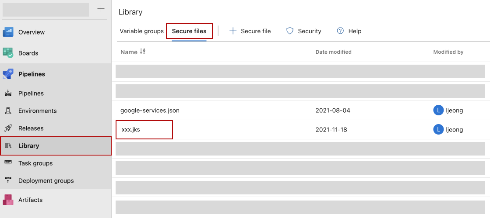
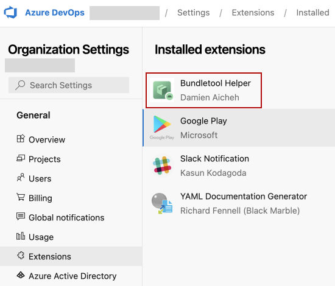
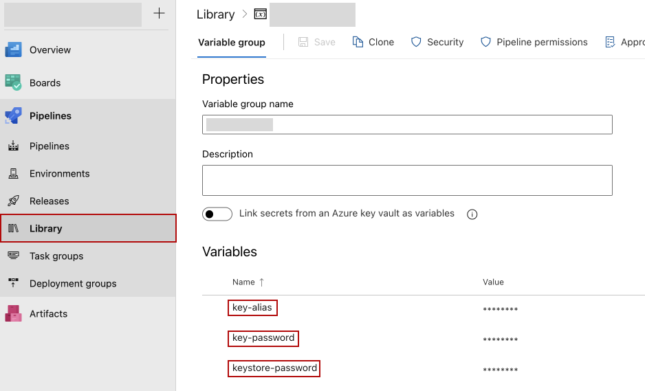
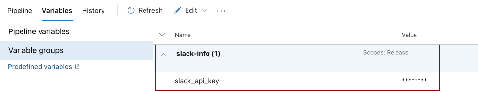
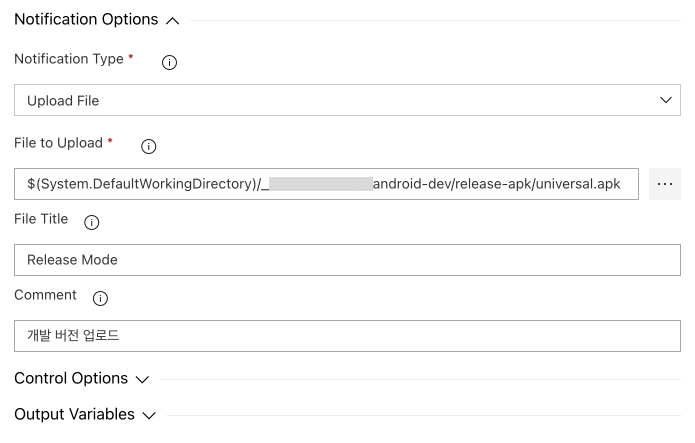

# 안드로이드 어플리케이션 CI/CD 파이프라인 구축

빌드와 배포용 도구로 **Azure Pipelines**를 사용합니다.

## 무중단 통합(CI)
1. develop 브랜치로 코드가 푸시되면 트리거되도록 설정합니다.
```yml
trigger:
  branches:
    include:
      - develop
```
2. platform-tools 31.0.3에서 오류가 나서 cmd line에서 31.0.1로 변경했습니다.</br>
(이 과정은 일반적인 CI 환경에서는 필요없는 절차입니다.)
`$ANDROID_HOME`은 Azure에서 사전에 지정해 놓은 환경변수로 /Users/runner/Library/Android/sdk/의 경로가 지정되어 있습니다.
```yml
- script: |
      rm -rf $ANDROID_HOME/platform-tools/ && \
      cd $ANDROID_HOME                         && \
      curl -sS https://dl.google.com/android/repository/d027ce0f9f214a4bd575a73786b44d8ccf7e7516.platform-tools_r31.0.1-darwin.zip > platform-tools.zip && \
      unzip platform-tools.zip                                  && \
      rm platform-tools.zip
  displayName: Download platform-tools
```
3. Azure Pipelines Library에 업로드한 google-services.json 파일을 다운로드 합니다.</br>
CI 스크립트에서 불러올 google-services.json 파일을 Azure DevOps Library에 미리 업로드 하였습니다.


```yml
- task: DownloadSecureFile@1
  name: download_google_services_json
  displayName: Download google-services json file
  inputs:
    secureFile: google-services.json
    retryCount: 5
```
4. google-services.json을 작업 디렉토리로 이동합니다.
`$(Agent.TempDirectory)`는 Azure에서 지정한 default 임시 디렉토리이며, 실제 경로는 /Users/runner/work/_temp/입니다.
`$(Build.SourcesDirectory)`도 Azure에서 지정한 default 작업 디렉토리이며, 실제 경로는 /Users/runner/work/1/s/입니다.
```yml
- script: |
    mv $(Agent.TempDirectory)/google-services.json $(Build.SourcesDirectory)/app/
```
5. Azure DevOps Library에 미리 업로드한 xxx.jks 파일을 다운로드 합니다.(App Signing Key)
s
```yml
- task: DownloadSecureFile@1
  name: download_signing_file
  displayName: Download signing file
  inputs:
    secureFile: xxx.jks
    retryCount: 5
```
6. App bundle로 빌드합니다.

```yml
  - task: Gradle@2
    displayName: Build App
    inputs:
      gradleWrapperFile: gradlew
      workingDirectory: $(Build.SourcesDirectory)
      tasks: :app:bundleRelease
      publishJUnitResults: false
      javaHomeOption: JDKVersion
      jdkVersionOption: 11
      gradleOptions: -Xmx3072m
      sonarQubeRunAnalysis: false
```
7. App bundle에 Signing (google play store console에 등록한 jks 전용)
```yml
 - task: CmdLine@2
   displayName: Signing and aligning AAB file(s)
   inputs:
      script: jarsigner -verbose -sigalg SHA256withRSA -digestalg SHA-256 -keystore $(Agent.TempDirectory)/hayd_android.jks -storepass $(KEYSTORE-PASSWORD) -keypass $(KEY-PASSWORD) $(system.defaultworkingdirectory)/app/build/outputs/bundle/productionRelease/app-production-release.aab $(KEY-ALIAS)
```
8. Signing 완료된 App bundle 파일을 작업 디렉토리로 복사합니다.</br>
참고로 여기서 `$(system.defaultworkingdirectory)`는 `$(Build.SourcesDirectory)`와 동일한 경로 입니다. (당시 대체 왜 다르게 쓴건지는 잘 모르겠습니다.) 복사는 **SourceFolder -> TargetFolder**로 이루어집니다.
```yml
 - task: CopyFiles@2
   displayName: Copy AAB file(s)
   inputs:
      SourceFolder: $(system.defaultworkingdirectory)/app/build/outputs/bundle/productionRelease/
      Contents: '**/*.aab'
      TargetFolder: $(Build.SourcesDirectory)/release/
```
9. App bundle publish
```yml
- task: PublishPipelineArtifact@1
  name: publish_pipeline_aab
  displayName: Publish pipeline AAB
  inputs:
    targetPath: $(Build.SourcesDirectory)/release/app-production-release.aab
    artifact: release-aab
    publishLocation: pipeline
```
10. 슬랙 APK 배포 채널에 새롭게 빌드한 APK 파일을 공유하기 위해 .aab -> .apk로 확장자를 변경해야 합니다. 이에 필요한 bundle tools 설치합니다.</br>
[Bundletool 다운로드](https://marketplace.visualstudio.com/items?itemName=DamienAicheh.bundletool-tasks) (관리자의 승인이 있어야 다운로드가 완료됩니다.)</br>

다운로드를 완료하고 나면 Github 계정 설정에서 personal access token을 발급받아야 합니다.

```yml
- task: InstallBundletool@1
  displayName: Install bundle tool
  inputs:
    username: $(github-username)
    personalAccessToken: $(github-personal-access-token)
```
11. App bundle을 APK 확장자로 변환하는 작업입니다.(여기서도 signing 작업을 위해 keystore 정보를 파라미터로 전달합니다.)
Azure Pipelines Library > Variable group에 Signing Key(**keystorePassword, keystoreAlias, keystoreAliasPassword**)를 미리 업로드 하였습니다. xxx.jks 파일은 앞에서 다운로드 하였으므로, **keystoreFilePath**에 파일경로를 기입합니다.

```yml
 - task: AabConvertToUniversalApk@1
   displayName: Convert AAB to APK
   inputs:
      aabFilePath: $(Build.SourcesDirectory)/release/app-production-release.aab
      keystoreFilePath: $(Agent.TempDirectory)/xxx.jks
      keystorePassword: $(KEYSTORE-PASSWORD)
      keystoreAlias: $(KEY-ALIAS)
      keystoreAliasPassword: $(KEY-PASSWORD)
      outputFolder: $(Build.SourcesDirectory)/release/
```
12. APKs publish
```yml
- task: PublishPipelineArtifact@1
  name: publish_pipeline_apk
  displayName: Publish pipeline APK
  inputs:
    targetPath: $(Build.SourcesDirectory)/release/universal.apk
    artifact: release-apk
    publishLocation: pipeline
```

**전체 스크립트**
```yml
# Android
# Build your Android project with Gradle.
# Add steps that test, sign, and distribute the APK, save build artifacts, and more:
# https://docs.microsoft.com/azure/devops/pipelines/languages/android

trigger:
  branches:
    include:
      - develop

pool:
  vmImage: macOS-12

steps:
  - script: |
      rm -rf $ANDROID_HOME/platform-tools/ && \
      cd $ANDROID_HOME                         && \
      curl -sS https://dl.google.com/android/repository/d027ce0f9f214a4bd575a73786b44d8ccf7e7516.platform-tools_r31.0.1-darwin.zip > platform-tools.zip && \
      unzip platform-tools.zip                                  && \
      rm platform-tools.zip
    displayName: Download platform-tools

  - task: DownloadSecureFile@1
    name: download_google_services_json
    displayName: Download google-services json file
    inputs:
      secureFile: google-services.json
      retryCount: 5

  - script: |
      mv $(Agent.TempDirectory)/google-services.json $(Build.SourcesDirectory)/app/

  - task: DownloadSecureFile@1
    name: download_privates_gradle
    displayName: Download privates gradle file
    inputs:
      secureFile: privates-dev.gradle
      retryCount: 5

  - script: |
      mv $(Agent.TempDirectory)/privates-dev.gradle $(Build.SourcesDirectory)/
      mv $(Build.SourcesDirectory)/privates-dev.gradle $(Build.SourcesDirectory)/privates.gradle

  - task: DownloadSecureFile@1
    name: download_signing_file
    displayName: Download signing file
    inputs:
      secureFile: hayd_android.jks
      retryCount: 5

  - task: Gradle@2
    displayName: Build App
    inputs:
      gradleWrapperFile: gradlew
      workingDirectory: $(Build.SourcesDirectory)
      tasks: :app:bundleRelease
      publishJUnitResults: false
      javaHomeOption: JDKVersion
      jdkVersionOption: 11
      gradleOptions: -Xmx3072m
      sonarQubeRunAnalysis: false

  - task: CmdLine@2
    displayName: Signing and aligning AAB file(s)
    inputs:
      script: jarsigner -verbose -sigalg SHA256withRSA -digestalg SHA-256 -keystore $(Agent.TempDirectory)/hayd_android.jks -storepass $(KEYSTORE-PASSWORD) -keypass $(KEY-PASSWORD) $(system.defaultworkingdirectory)/app/build/outputs/bundle/productionRelease/app-production-release.aab $(KEY-ALIAS)

  - task: CopyFiles@2
    displayName: Copy AAB file(s)
    inputs:
      SourceFolder: $(system.defaultworkingdirectory)/app/build/outputs/bundle/productionRelease/
      Contents: '**/*.aab'
      TargetFolder: $(Build.SourcesDirectory)/release/

  - task: PublishPipelineArtifact@1
    name: publish_pipeline_aab
    displayName: Publish pipeline AAB
    inputs:
      targetPath: $(Build.SourcesDirectory)/release/app-production-release.aab
      artifact: release-aab
      publishLocation: pipeline

  - task: InstallBundletool@1
    displayName: Install bundle tool
    inputs:
      username: $(github-username)
      personalAccessToken: $(github-personal-access-token)

  - task: AabConvertToUniversalApk@1
    displayName: Convert AAB to APK
    inputs:
      aabFilePath: $(Build.SourcesDirectory)/release/app-production-release.aab
      keystoreFilePath: $(Agent.TempDirectory)/hayd_android.jks
      keystorePassword: $(KEYSTORE-PASSWORD)
      keystoreAlias: $(KEY-ALIAS)
      keystoreAliasPassword: $(KEY-PASSWORD)
      outputFolder: $(Build.SourcesDirectory)/release/

  - task: PublishPipelineArtifact@1
    name: publish_pipeline_apk
    displayName: Publish pipeline APK
    inputs:
      targetPath: $(Build.SourcesDirectory)/release/universal.apk
      artifact: release-apk
      publishLocation: pipeline
```

### 무중단 배포(CD)
개발과 운영 파이프라인을 분리하였습니다.</br> 
개발 파이프라인에서는 빌드된 Artifacts를 슬랙 APK(apk) 공유 채널에 업로드 합니다.</br>
운영 파이프라인은 앱 번들(aab)을 구글 플레이스토어 콘솔 내부 테스트에 업로드 합니다.


파이프라인을 새로 생성합니다.</br>

 
Artifact를 추가합니다.


**슬랙 채널에 APK 업로드**

슬랙 third party 앱을 이용하려면 Extensions를 미리 다운받아야 합니다.(앞서 Bundletool을 내려받은 방식과 같습니다.)


발급받은 슬랙 API 키를 Azure Pipelines Library에 추가하여 가져옵니다.



빌드된 APK를 슬랙에 업로드할 파일로 지정합니다.


**구글 플레이스토어 콘솔 내부 테스트 버전 배포**
ㄴ
구글 플레이스토어 콘솔 third party 앱을 이용하려면 Extensions를 미리 다운받아야 합니다.(앞서 Bundletool과 슬랙을 내려받은 방식과 같습니다.)


