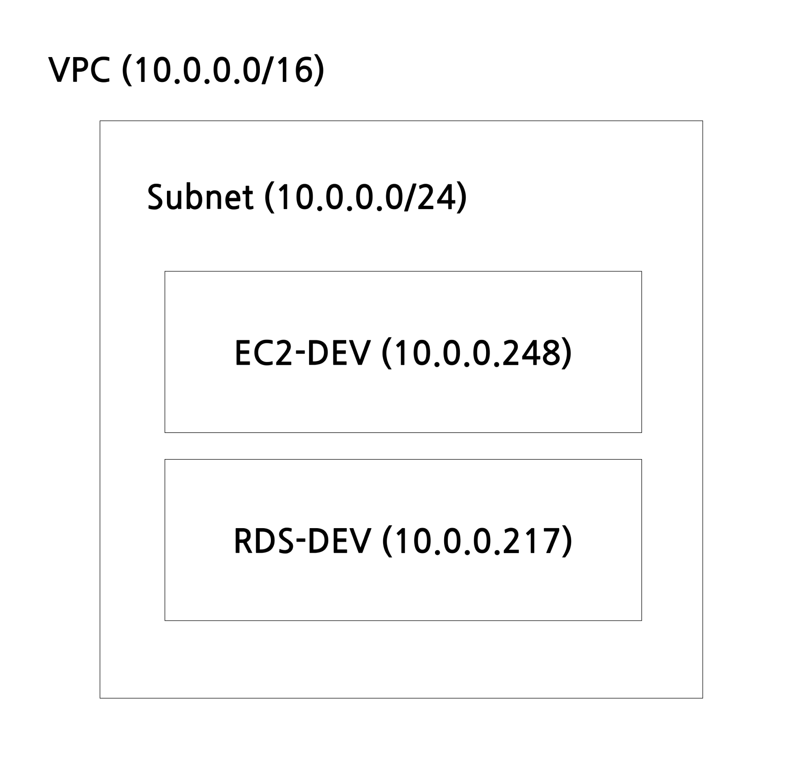
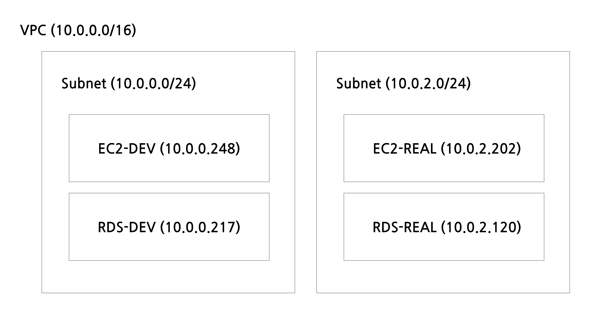
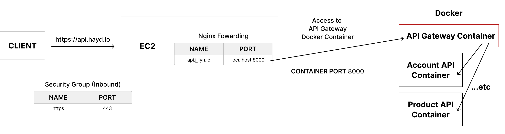
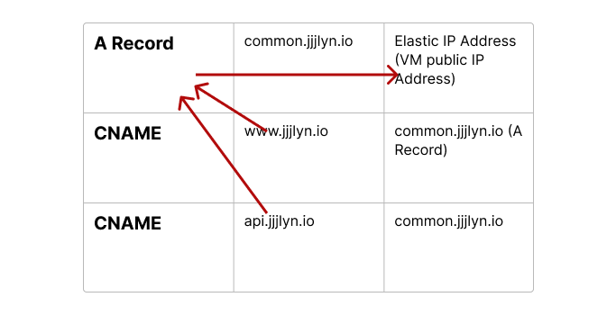
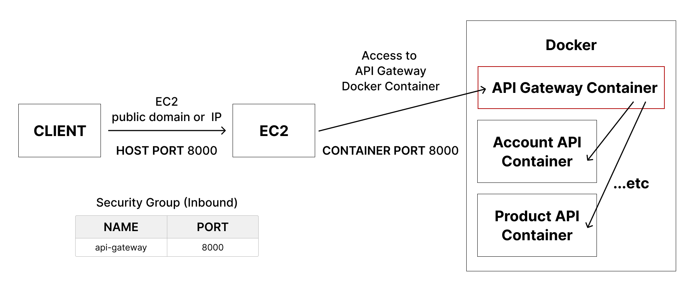

# 스타트업 앱 서비스 배포 경험기
> 본래 안드로이드 개발자로 합류하였으나 팀 내부 사정으로 인하여 서비스 배포까지 하게 된 경험을 공유합니다.<br>
초기 스타트업으로 신규 서비스 개발부터 배포까지의 전 과정을 아울러야 했습니다.<br>
클라우드 서비스 + 데브옵스 + 도커를 이용하여 개발 환경을 구축하였습니다.

## 서버 구성
### 운영 환경
원래 운영 환경은 Azure, 개발은 AWS로 구축되었으나 Azure 구독료가 부담스러운 관계로 2022년 9월 13일 기준 운영까지 AWS로 주요 리소스를 이전하였습니다.
- Azure에서 사용하는 리소스(현재)
  - 스토리지 계정(Blob Service)
  - ~~정적 웹앱~~
  - SaaS(SendGrid 메일링 서비스)
  - DNS Zone
  - 키 자격 증명 모음(키, 비밀)

- AWS에서 사용하는 리소스(현재)
  - EC2
  - RDS
  - Router53

개발 환경만 구축된 AWS는 아래와 같은 구조로 VPC 내에 서브넷 한개로 구성되어 있습니다. 기존 서브넷으로는 내부 IP를 250개 정도 사용가능하여 개발용으로는 충분하나 운영에서는 부족할 수 있어 서브넷을 추가로 생성하였습니다. (둘 다 퍼블릭 서브넷 입니다.)


개발, 운영환경을 구분한 모습입니다.



다음은 운영 환경 구조도 입니다.


전체 흐름은 하단의 조건을 성립해야 했습니다.
- EC2, RDS 보안그룹 지정
- 서비스 사용자는 `www.jjjlyn.io/***/***` 등의 URL로 자원을 요청할 수 있습니다. (편의상 도메인 이름은 제 닉네임인 `jjjlyn`, 서브 도메인은 `www`로 하겠습니다.)
- TLS가 적용되어야 합니다.
- 공용 IP주소에 도메인이 적용되어야 합니다. (예: 123.123.123.123 -> jjjlyn.io)

<!-- 
 -->

조건을 만족시키기 위해 아래 과정을 수행하였습니다. (AWS 기준)

**보안그룹 지정**

EC2 인바운드 보안그룹에는 접속하려는 IP, PORT에 대해서만 추가하면 됩니다. 예컨데 443(HTTP), 2376(도커 데몬 소켓), 22(SSH), 21(FTP) 등이 있습니다. IP는 모두 허용하도록 설정했습니다(0.0.0.0).</br>
RDS 인바운드 보안그룹 설정에서 주의해야 할 사항이 있습니다. **EC2에서 RDS로의 접속을 허용할 때, 반드시 EC2의 내부 IP(외부 IP X)를 허용 가능한 IP로 지정해야 한다는 점입니다.** AWS VPC 설정 시 VPC 서브넷 전용 라우팅 테이블을 생성합니다. 라우팅 테이블은 VPC 내 서브넷 자원의 아웃바운드 트래픽을 특정 장소(local 혹은 인터넷)로 전달하는 역할을 합니다. 동일 서브넷의 서로 다른 자원 간의 통신은 라우팅 테이블을 거치지 않지만, 같은 VPC 권역에 있더라도 다른 서브넷의 자원을 요청한 경우에는 라우팅 테이블을 거치게 됩니다. VPC의 CIDL 블록 범위에 있는 10.0.0.0/16의 트래픽인 경우 local로, 그 외 모든 IP(0.0.0.0/0)는 인터넷 게이트웨이로 보냅니다. 만약 RDS의 인바운드 보안그룹에 EC2의 외부 IP를 등록하게 되면, 라우팅 테이블의 명시에 따라 인터넷 게이트웨이로 트래픽이 나갑니다. 이 경우 외부에서 RDS로 접근을 시도하는 것인데, RDS 보안그룹에서는 외부 트래픽을 차단하였기 때문에 접속이 되지 않습니다.

**도메인 설정**
  - 도메인 호스팅 사이트에서 도메인 구매(고대디에서 구매)
  - Route53에서 발급받은 네임서버 4개 도메인 호스팅 사이트에 적용
  - Route53에 도메인 등록 (예: `jjjlyn.io`)
  - Route53에 A레코드로 VM 퍼블릭 IP 주소 등록 (예: `cname.jjjlyn.io` -> `123.123.123.123`로 매핑)
  - CNAME 추가 (예: `admin.jjjlyn.io` -> `cname.jjjlyn.io`로 매핑)
  

**TLS 적용**

보안서버 인증서 구매 (Korea SSL에서 구매)

**VM Nginx 설정과 도커 환경 구축**
  - Nginx 포트 포워딩 (Nginx의 포트포워딩을 사용하면 내부망의 서버 정보를 외부로부터 은닉할 수 있음)
  - 도커 설정

Nginx와 도커를 설치한 후, 도커 허브에서 registry 이미지를 `pull` 받고 컨테이너화 해야 합니다.
> docker private registy 사용 이유
> 
> 도커는 개발자가 만든 이미지를 공유하는 공식 저장소(docker hub)를 제공하고 있습니다. 그러나 사내 환경에서는 모든 이미지를 전체 도커 사용자에게 공유하지 않고 내부망에서만 관리해야 할 필요가 있습니다. 그럴 때 필요한 원격 저장소가 docker private registry입니다. 컨테이너 포트는 기본값 5000번으로 지정되어 있습니다.

docker private registry도 Nginx에서 관리할 수 있도록 CNAME으로 추가해 주었습니다. (예: `docker.jjjlyn.io` -> `common.jjjlyn.io`로 매핑)<br/>Nginx에서 로컬호스트 5000번(편의상 도커 컨테이너 포트 기본값 5000번과 동일한 5000번으로 지정)으로 이동하도록 포트포워딩 설정도 해줍니다.
[참고 - 도커 외부통신 동작 원리](/infra/how-docker-network-works.md)

VM 도커 컨테이너는 CLI에서 `docker run`로 직접 띄우거나 `docker compose`를 이용하여 한꺼번에 띄울 수 있지만, 팀에서는 Azure Pipelines를 사용했습니다.</br>자세한 내용은 [Azure Pipelines로 CI/CD 자동화하기](/infra/ci_cd/server-app-ci-cd.md)를 참고해주세요:)

DNS Zone(AWS 기준 Route53)에서 추가한 서브 도메인에 대해 Nginx 포트 포워딩을 해 줍니다. 위에서 언급한 `docker.jjjlyn.io`를 예시로 들겠습니다.<br>

외부에서 `https://docker.jjjlyn.io`로 요청<br>
-> 운영서버의 로컬호스트 5000번으로 포워딩<br>
-> 로컬호스트 5000번과 바인딩된 도커 컨테이너로 포워딩<br>
의 과정이 이루어져야 합니다.

먼저 ssh로 운영 VM에 접근합니다.
```bash
$ ssh -i private-key [사용자명]@[VM IP 주소 혹은 도메인] -p 22
```

Nginx 설정 폴더에 진입합니다.
```bash
$ cd /etc/nginx/
$ ls
```


`sites-enabled`에 진입하여 파일을 생성합니다.<br>
```bash
$ cd sites-enabled/
$ vi docker.jjjlyn.io
```

```vi
# 80번(http)로 접근할 시 https로 리다이렉트
server {
       listen 80;

       server_name docker.jjjlyn.io;
       location / {
                return 301 https://docker.jjjlyn.io$request_uri;
       }
}
server {
        listen 443;
        server_name docker.jjjlyn.io;

        ssl on;

        # TLS 인증서 적용
        ssl_certificate /etc/nginx/ca.crt;
        ssl_certificate_key /etc/nginx/ca.key;
        ssl_session_timeout 3m;
        ssl_protocols TLSv1 TLSv1.1 TLSv1.2 TLSv1.3;
        ssl_prefer_server_ciphers   on;

        client_max_body_size 0;
        chunked_transfer_encoding on;
        location / {
                rewrite ^(/.*)$ $1 break;
                proxy_pass_header Server;
                proxy_set_header Host $http_host;
                proxy_set_header X-Real-IP $remote_addr;
                proxy_set_header X-Forwarded-Proto $scheme;
                # docker.jjjlyn.io으로 들어온 요청은 로컬호스트 5000번으로 포트 포워딩
                proxy_pass http://127.0.0.1:5000/;
                proxy_redirect off;
        }
}
```

`nginx.conf`에서 `docker.jjjlyn.io` 포트 포워딩 설정이 반영되도록 합니다.
```bash
$ cd ..
$ vi nginx.conf

http {
        # 기본 설정 생략
        include /etc/nginx/sites-enabled/*;
}
```

이제 도커 허브에서 받아온 registry 이미지를 컨테이너화 해야 합니다. 외부에서 호스트 포트 5000번으로 요청이 들어올 경우 레지스트리 도커 컨테이너의 5000번 포트로 이를 전달해야 하기 때문에 `docker run` 실행 시 `-p 5000:5000` 매개변수를 넣어 주어야 합니다. 추가로 Basic Authentication(보안 목적)을 위해 `htpasswd`도 적용합니다.

이렇게 Basic Authentication과 TLS를 모두 적용하고 나면, Azure Pipelines(외부)에서 `https://docker.jjjlyn.io` URL로 요청할 때만 Nginx를 통해 로컬호스트 5000번으로 포트 포워딩 되기 때문에 docker private registry를 노출시킬 위험을 줄일 수 있습니다.

<!-- 어플리케이션 별 CI/CD 파이프라인 구축에 관해서 자세한 내용은 링크를 통해 확인하실 수 있습니다.
- [안드로이드 어플리케이션]()
- [서버 어플리케이션]()
- [정적 웹앱]() -->
  
### 개발 환경
서비스 첫 배포에 앞서 개발과 운영 환경을 분리해야 했습니다.
Azure 가상머신과 비교하여 한화로 약 10만원 정도의 차이가 있고, 마침 지급받은 AWS 크레딧이 있어 AWS를 채택하였습니다.

팀 내부에서만 사용하기에 트래픽이 거의 발생할 일이 없어
- vCPU 4개, RAM 16GiB, SSD 64GiB의 일반적인 성능을 갖춘 가상머신을 선택했습니다.
- RDS는 프리티어 조건으로 하였습니다.

운영에 비해 구조를 간소화 하였습니다. 이를테면 웹서버를 통한 포트포워딩은 과감히 생략했습니다. 대신 AWS 보안그룹 인바운드 설정에서 API Gateway(Spring Cloud Gateway를 사용하였음)의 포트(예: 8000번)만을 허용하여 이를 통해 다른 컨테이너의 포트로 접근할 수 있도록 했습니다.
<image width="894" alt="" src="images/dev-ec2-security-group.png"/>

다음은 개발 환경 구조도 입니다.


<!--  -->

Azure Pipelines 빌드 환경에서 docker private registry에 접근하는 것은 외부에서 내부망으로 접속하는 것과 같습니다. 도커 환경에서는 보안상의 이유로 클라이언트와 원격지의 registry간 통신에서 https 프로토콜만을 허용합니다. 개발용으로 사설 TLS 인증서를 구매할 필요는 없어 자체 서명 인증서(Self-Signed Root CA)를 생성했습니다.

자체 서명 인증서를 발급받고 registry 컨테이너에 적용하는 방법 입니다. 키 이름은 편의상 `temp`로 지정하였습니다. 폴더명과 경로는 `~/certs`로 하는 것을 추천합니다. 여기서는 편의상 `test-ssl`라는 임시 폴더를 생성하였습니다.
```bash
mkdir ./test-ssl
cd certs/
openssl genrsa -des3 -out temp.key 2048
```


```bash
openssl req -new -key temp.key -out temp.csr
```


```bash
openssl rsa -in temp.key -out temp.key
```


한 가지 주의할 점은 아래 단계에서 {DOCKER_HOST_IP}에 registry 컨테이너가 존재하는 원격지의 외부 IP 주소를 지정해야 한다는 것입니다. 차후 클라이언트에서 원격지 registry에 REST API 요청을 할 때, 여기서 지정한 IP 주소로 호출을 시도합니다.
```bash
echo subjectAltName=IP:{도커 레지스트리 서버 IP} > extfile.cnf
```

```bash
openssl x509 -req -days 800 -signkey temp.key -in temp.csr -out temp.crt -extfile extfile.cnf
```


**클라이언트와 호스트가 https 통신을 하려면 호스트(원격지) 서버에서 자체 서명한 인증서를 클라이언트 환경의 `신뢰할 수 있는 인증서 목록`에 추가해야 합니다.** 이후에는 외부에서 내부망의 registry에 자유롭게 REST API로 요청할 수 있습니다.

외부에서 REST API를 사용하여 원격지 registry에 저장된 이미지 목록을 불러오게 하는 예시입니다.<br>
```bash
curl -X https://{DOCKER_HOST_IP}:5000/v2/_catalog
```
`docker ps`나 `docker pull` 등의 도커 관련 명령어를 사용하는 것도 내부적으로는 REST API로 도커 데몬을 통해 도커 호스트로 요청하는 것과 같습니다.

그런데 registry에 대한 권한이 있는 사용자만 접근할 수 있어야 하겠죠. 이를 위해 basic auth로 추가 보안을 해주어야 합니다.

```bash
apt install apache2-utils
htpasswd -Bbn {레지스트리 ID} {비밀번호} > /home/{사용자 디렉토리}/certs/htpasswd
```

레지스트리 이미지를 컨테이너로 띄웁니다. TLS와 basic auth를 모두 지정해야 합니다.
```bash
docker run --name registry -d --restart=always -p 5000:5000 \  
-v /home/ubuntu/certs:/certs \  
-v /data/registry:/var/lib/registry/Docker/registry/v2 \  
-e REGISTRY_HTTP_TLS_CERTIFICATE=/certs/temp.crt \  
-e REGISTRY_HTTP_TLS_KEY=/certs/temp.key \    
-e REGISTRY_AUTH=htpasswd \     
-e "REGISTRY_AUTH_HTPASSWD_REALM=Registry Realm" \     
-e REGISTRY_AUTH_HTPASSWD_PATH=/certs/htpasswd \     
registry:2.7.0  
```

이제 외부에서 원격지 registry의 아이디, 패스워드를 헤더에 담아 요청하지 않으면 `authentication required` 오류 메시지가 뜨면서, 권한이 없는 사용자는 접근하지 못하게 됩니다.


아래와 같이 레지스트리 ID와 비밀번호를 헤더에 담아 요청해야 합니다.
```bash 
curl --user {레지스트리 ID}:{비밀번호} -X GET https://{외부 IP}:5000/v2/_catalog
```

레지스트리 이미지 목록을 성공적으로 가져온 예시입니다.


위에서도 언급하였지만, 클라이언트와 호스트가 https 통신을 하려면 자체 서명 인증서를 클라이언트 환경의 `신뢰할 수 있는 인증서 목록`에 추가해야 합니다. 로컬에서 원격지의 registry에 접근하는 경우에는 로컬(클라이언트) 환경에 한번 적용한 후 계속 목록에 유지될 것입니다. 그러나 Azure Pipelines와 같이 매번 새로운 빌드 환경을 제공하는 경우에는 어떻게 해야 할까요?

저는 자체 인증서 추가 로직을 CI/CD 파이프라인에 삽입했습니다. 자세한 내용은 [Azure Pipelines로 CI/CD 자동화하기](/infra/ci_cd/server-app-ci-cd.md)에서 확인하실 수 있습니다.

## 운영 중 이슈
지속적인 앱 업데이트 과정에서 쌓이는 도커 이미지는 어떻게 지워야 할까요? private registry가 꽉 차 가상머신 서버가 멈출 경우 대처 방법을 공유합니다.
[docker image GC 스크립트](https://github.com/andrey-pohilko/registry-cli)

1. Docker를 이용해 이미지를 삭제하는 방법</br>
registry-cli 이미지를 내려받습니다.
```bash
docker pull anoxis/registry-cli
```

Private Registry에 지정한 이름이 `personal-registry`로 확인됩니다.


`personal-registry`로 registry-cli를 작동시킵니다.
참고로 `--rm`은 컨테이너가 종료되면 자동으로 삭제하라는 옵션입니다.
```bash
docker run --rm --link personal-registry anoxis/registry-cli -r http://personal-registry:5000
```


2. 파이썬 파일을 이용해 이미지를 삭제하는 방법</br>
가상머신에 `registry.py`와 `requirements-build.txt`를 다운받아 파이썬 파일을 실행하는 방법도 있습니다. vi 편집기로 문서 파일을 생성하여 복사-붙여넣기해도 됩니다. 


registy.py를 실행할 수 있도록 권한을 부여합니다.
```bash
chmod 755 registry.py
```

의존성을 추가합니다.
```bash
sudo pip install -r requirements-build.txt
```

오래된 이미지를 삭제합니다.(5개 이미지 삭제 옵션을 준 예시입니다.)
```bash
./registry.py -l user:pass -r http://localhost:5000 --delete --num 5
```